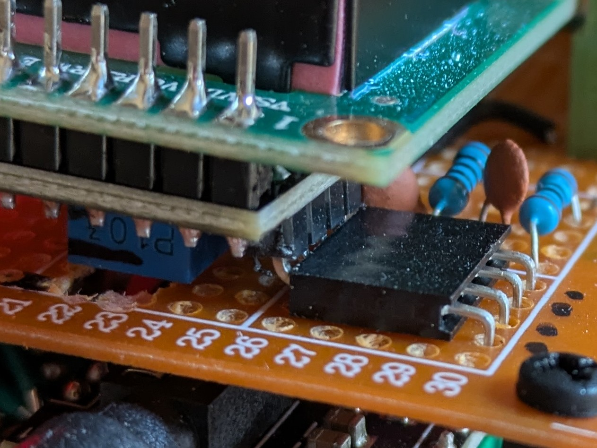

# Version 1 build details

## hardware
* ESP32 DevkitC N8R8
* ES8388 audio board
* LCD1602 display (i2c interface)
* 2 buttons
* usb cable with on/off switch
## software
* espressif_button component
* zorxx__lcd1602 component
* mp3 and aac streams confirmed.  flac is implemented but not currently working
* current station selection stored in NVS
* wifi and station configuration compiled in code.

## construction
* bottom board
  * esp32 devkit
  * es8388 audio board
  * 4 pullup resistors for two i2c buses.  One i2c bus supports es8388 communication and the other supports lcd1602 communication.
  * I did not build out the low pass filter for the es8388 i2c.  Initialization works (perhaps because the i2s bus hasn't started yet) but further i2c communication is lost.  In a future version I'll build the low pass filter on this bus.
* top board
  * use 3x2pin screw header to lead lines from bottom board to top board
    * reading from lcd 1602 side: gnd, vcc, sda, scl, station down, station up
  * mount 4 pin 90 deg. connector to attach to lcd 1602
  * low pass filters for sda and scl on top board on the far side of the lcd 1602 connector
  * cut hole in top board for lcd 1602 contrast trip pot.

