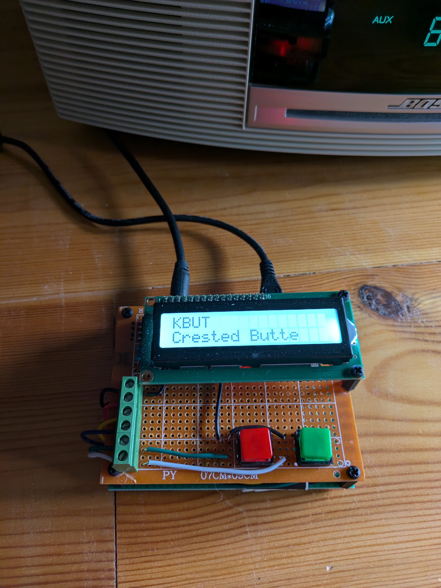
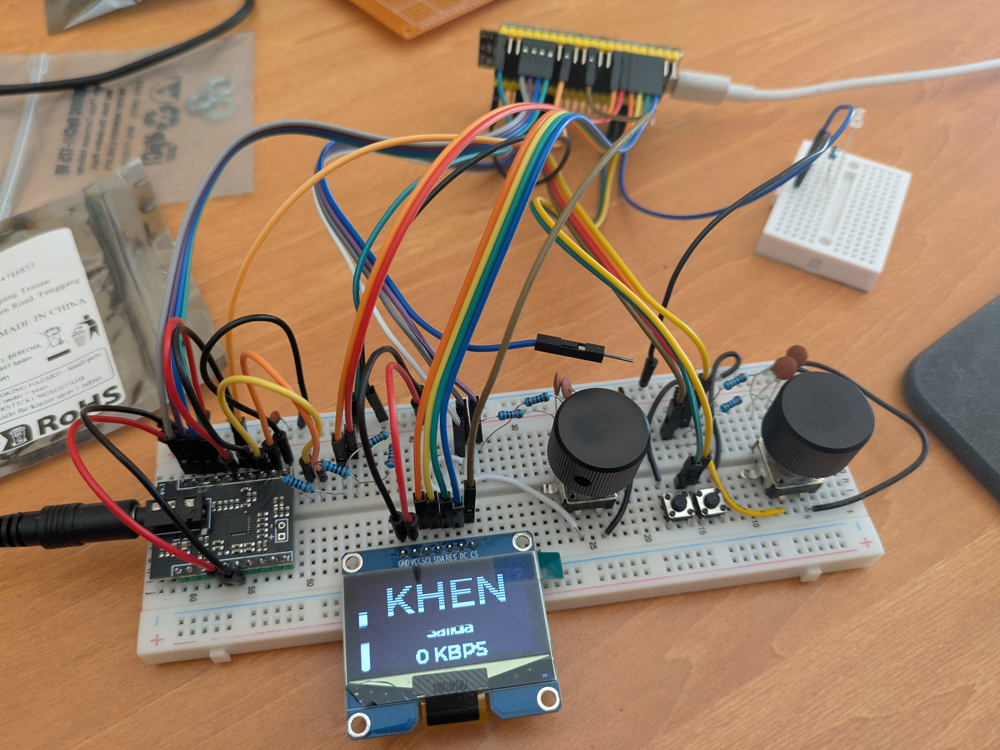
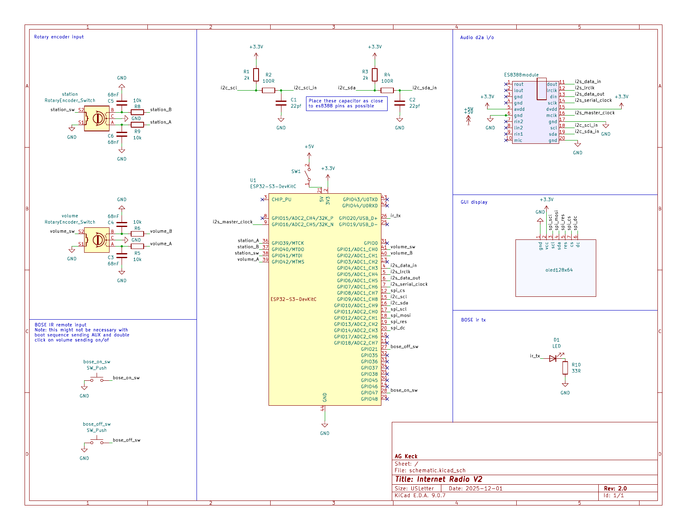

# Version 2 build details

## hardware
* ESP32s3 DevkitC N16R8
* ES8388 audio board
  * both clock and data lines require low pass filters with caps close to es8388
* 2 rotary encoders with push buttons and hardware debounce
  * encoder 1: volume + mute
  * encoder 2: station selection + display ip address + reboot
* 2 pushbuttons
  * button 1: send bose aux signal on IR led
  * button 2: send bose aux followed by on/off signals on IR led
  * holding button 2 during boot enters provisioning mode

* 1 IR LED
* 1 OLED? display spi interface
### prototype

### schematic
 

## software

### audio pipeline
The audio pipeline is virtually the same as in version 1.  We added an accumulator to count the bytes read from the http stream and a periodic task to calculate/update the bitrate display on the screen.  This task calculates a 10 second weighted average of one second bitrates.  When this weighted average is 0 we know that we have not received data for 10 seconds.  We use this signal along with a delay of 15 seconds to determine if we need to reboot the device.  If we have not received data for 10 seconds and we are at least 15 seconds since last boot we reboot the device.
### audio board
Version 1 used the LyraT sdkconfig option to identify the audio board.  In version 2 we attempt to create a custom audio board with only the necessary components.  This attempt is partially successful. We can initialize and utilize the board but there is still a lot of cruft in the custom board definition.  We will need to clean this up.
### encoders
The hardware pulse counters track the position of the encoders. This device has interupts for pulse thresholds but not for changes in pulse counts.  We use a polling task to check the pulse counts and update the encoder position.  For the volume encoder we clamp the value to the range [0, 100] and arrange the relationship between the pulse count and the [0, 100] range to saturate at the endpoints.  In this way, even if the user turns well past an endpoint the reverse movement will immediately affect the value.
### lvgl
### wifi
### ir
The Bose Wave radio uses an IR remote control for all functions. Version 2 is designed for this particular unit so we generate our own IR signals to control the radio.  After sniffing the IR signals with ir_nec_transciever project we see that the radio does not use the NEC protocal.  Using 10 samples of the on/off button and 10 samples of the aux button we create a concensus signal for each message. The colab: `bose_sig_analysis.ipynb` shows the analysis of the IR signals.

The bose IR protocal is stateful: the on/off button performs different functions based on the state of the radio.  The aux button is stateless, this signal will always result in the radio being on with input from the aux jack.  Therefore we use aux as the on signal and aux + on/off as the off signal.  We send aux during the boot sequence to ensure that the radio is on when we boot.  We expect the user to press the off button to turn the radio off.
### nvs
### station data
Initial station data is stored in a constant array.  On first boot, if the spiffs is not initialized we create a default station json file based on the constant array.  Thereafter, on boot the spiffs should be found and the json file serves as the source of truth for station data.  We provide an API to load the station data from the json file and save the station data to the json file.

```{bash}
curl -X POST -H "Content-Type: application/json" -d '[{"call_sign":"TestRadio","origin":"Home","uri":"http://test.com","codec":1}]' http://<ESP32_IP_ADDRESS>/api/stations
```
where the codec enum uses these values:
0: MP3
1: AAC
2: OGG
3: FLAC

### web update to station data
We provide a web interface to update the station data at <ESP32_IP_ADDRESS>/api/stations (or just <ESP_IP_ADDRESS> where there is a link to station data.)  From the web interface we can add, remove, and update station data as well a reorder the list of stations.  The station data is saved to the spiffs and a reboot will apply the changes.

## construction

## operation

The radio manages its user interface primarily through two rotary encoders, each with an integrated push button.

### Volume Encoder
*   **Rotation**: Adjusts the volume between 0 and 100.
    *   Changes are reflected immediately on the OLED volume slider.
    *   The volume level is saved to NVS and persists across reboots.
    *   Rotating the knob while muted will automatically unmute the device.
*   **Button Press (Single Click)**: Toggles **Mute**.
    *   Muting sets the volume to 0.
    *   Unmuting restores the volume to the previous level.
*   **Button Press (Double Click)**: Sends a **Bose ON/OFF** IR command (via the IR transmitter).

### Station Encoder
*   **Rotation**: detailed station selection.
    *   Turning the knob switches the display to the "Station Selection" screen.
    *   You can scroll through the available stations (wrapping around the list).
    *   **Selection**: Stop turning the knob to select a station. After **2 seconds** of inactivity, the radio will:
        1.  Switch to the selected station.
        2.  Begin streaming.
        3.  Return to the Home screen.
*   **Button Press (Short)**: Displays the device's **IP Address** on the screen for 5 seconds, then returns to Home.
*   **Button Press (Long > 1.5s)**: **Reboots** the device. A reboot message is displayed before the system restarts.
*   **Hold During Boot**: Forces **Reprovisioning**.
    *   If the button is held down while the device powers on, it will erase current Wi-Fi credentials and return to provisioning mode.
